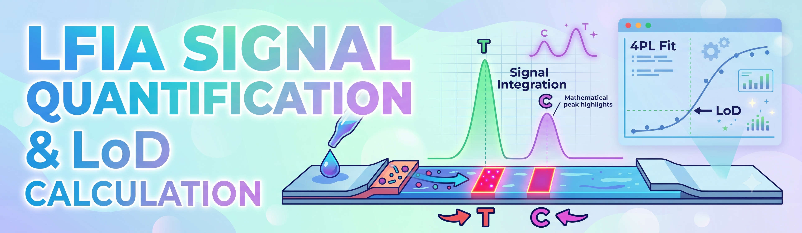
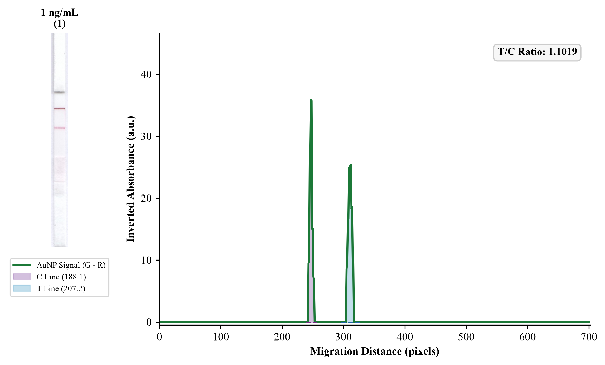
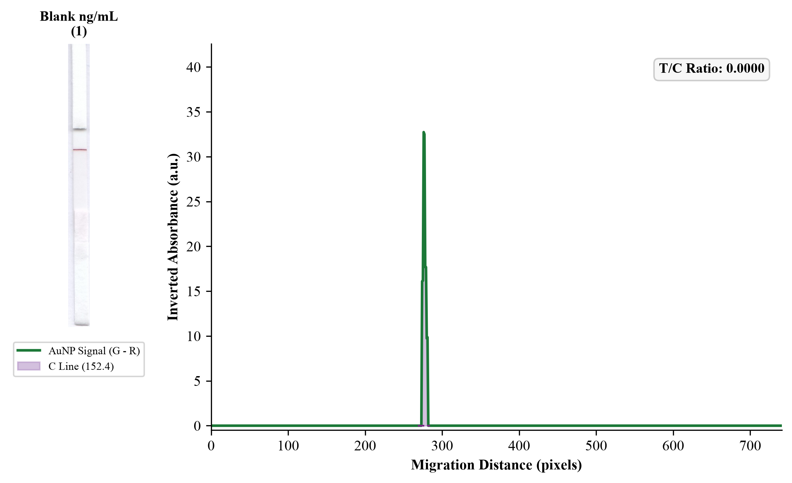
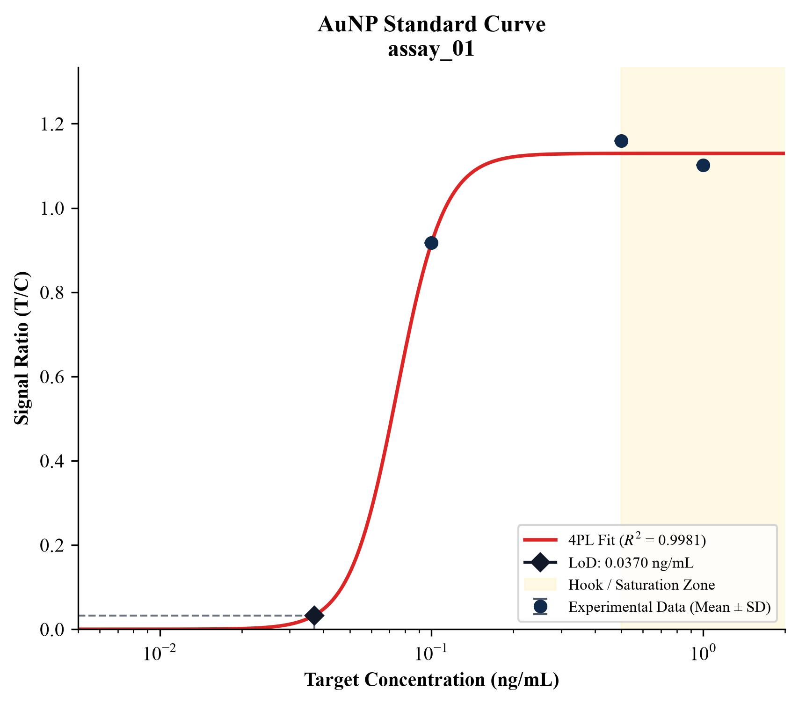

[](https://doi.org/10.5281/zenodo.23160097)

<div align="center">
  
  <h1>LFIA Signal Quantification & LoD Calculation</h1>
</div>

[](https://colab.research.google.com/github/harishs-io/lateral_flowimmunoassay_quant/blob/main/notebooks/lfia_quant.ipynb)


A high-throughput computer vision and bioanalytical pipeline for colloidal gold (AuNP) Lateral Flow Immunoassays (LFIA).

## Key Features
- **YOLOv8 Automated Localization:** Snug boundary cropping of LFIA strips, eliminating background clutter and illumination drift.
- **LSPR Differential Contrast (G - R):** Exploits localized surface plasmon resonance of AuNP (~530 nm absorption) while subtracting paper scattering (~650 nm reflection).
- **Dynamic Baseline Area Integration:** Calculates analytical Control (C) and Test (T) line peak areas using local slope baseline subtraction.
- **Hook-Effect & Saturation-Aware 4PL Fit:** Inverse-variance ($1/y^2$) weighted 4-Parameter Logistic regression that automatically identifies saturation plateaus and prozone/hook effects.
- **CLSI EP17 Compliance:** Computes Limit of Blank (LoB) and Limit of Detection (LoD) strictly from baseline zero and low-concentration replicate variance.

---

## Example Analysis & Calibration Outputs

### Sample Quantification Output (1 ng/mL)	


### Blank Control Output


### Standard Calibration Curve



## Installation

```bash
git clone https://github.com/harishs-io/lateral_flowimmunoassay_quant.git
cd lateral_flowimmunoassay_quant

python3 -m venv venv
source venv/bin/activate
pip install -r requirements.txt
pip install -e .
